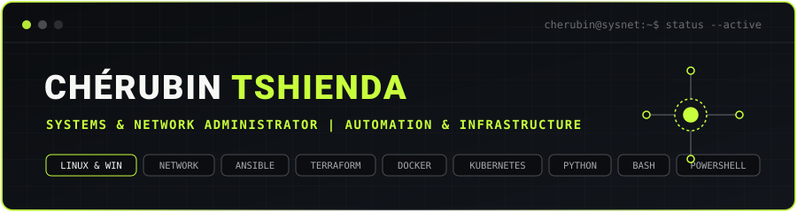

  <!-- Bannière Principale Haute Définition -->
    

  <!-- Animation texte dactylographique -->
  

   

  <!-- Liens de contact -->
  

    
    &nbsp;
    
    &nbsp;
    
  

---

###  Présentation

Bonjour, moi c'est **Chérubin Tshienda**.

**Administrateur systèmes et réseaux**, passionné par les infrastructures informatiques, l'automatisation et le développement.

J'aime comprendre les systèmes, résoudre des problèmes techniques et créer des solutions qui simplifient les tâches du quotidien.

Sur ce GitHub, je partage mes **projets, expérimentations et outils** autour des systèmes, réseaux, automatisation et développement.

---

###  Certifications Cisco

  
  &nbsp;
  
  &nbsp;
  
    
  
  &nbsp;
  
  &nbsp;
  

---

###  Compétences & Technologies

<table>
  <tr>
    <td width="25%" valign="top">
      

         
        <strong>Systèmes</strong>
      

       
       
       
      
    </td>
    <td width="25%" valign="top">
      

         
        <strong>Réseaux</strong>
      

       
       
       
      
    </td>
    <td width="25%" valign="top">
      

         
        <strong>Automatisation</strong>
      

       
       
       
      
    </td>
    <td width="25%" valign="top">
      

         
        <strong>Supervision & Dev</strong>
      

       
       
       
      
    </td>
  </tr>
</table>

---

###  Projets en Vedette

| Projet | Description | Technologies |
| :--- | :--- | :--- |
|  **[Ubuntu-Admin-Chatbot](https://github.com/CherubinSysNet)** | Assistant pour exécuter des tâches d'administration et de maintenance à distance sur plusieurs serveurs Ubuntu. | `Python` `Ubuntu` `Linux` |
|  **[Windows-Server-Ansible](https://github.com/CherubinSysNet)** | Automatisation complète du déploiement et de la configuration de machines Windows Server. | `Ansible` `Windows Server` `YAML` |
|  **[Monitoring-Stack](https://github.com/CherubinSysNet)** | Tableau de bord de suivi en temps réel de la performance des serveurs et du trafic réseau. | `Zabbix` `Prometheus` `Grafana` |
|  **[Network-Lab-Cisco](https://github.com/CherubinSysNet)** | Maquettes d'infrastructures réseaux d'entreprise avec routage, segmentation VLAN et sécurité. | `Cisco` `GNS3` `Packet Tracer` |

---

###  Statistiques GitHub

  <table border="0">
    <tr>
      <td>
        
      </td>
      <td>
        
      </td>
    </tr>
  </table>

   

  

---

  <!-- Séparateur bas -->
  

